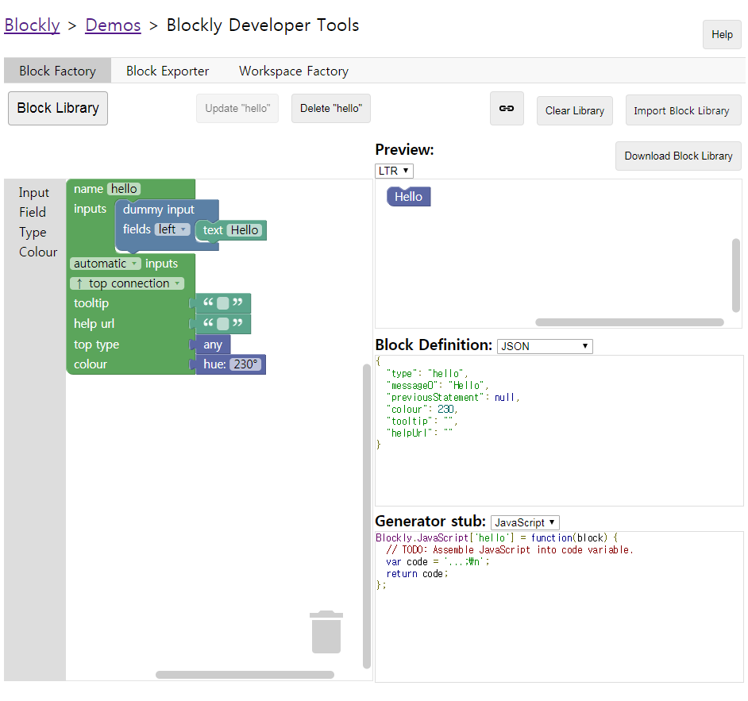
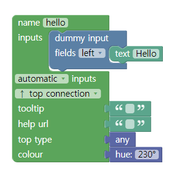
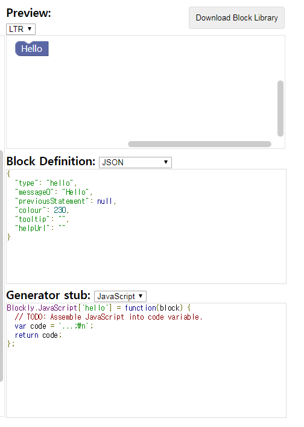
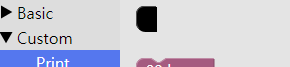
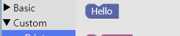

Itsy-Bitsy Tips for Blockly 1. Do not Just Copy&Paste the Developer Tool
====================================

[Blockly Developer Tools](https://blockly-demo.appspot.com/static/demos/blockfactory/index.html) is a very useful and powerful tool for creating custom blocks using Blockly. Using it, you can save a lot of typing and time. Also, it is very helpful for understanding the structure of Blockly blocks.



Even though it is a nice tool to use, you need to pay a little bit more attention when applying it to your project.
That is because **Blockly Developer Tools does not provide finished code**. Rather, it provides a **core configuration** of each block. So you have to add more code for it to work properly.

What Must be Added on Block Definition Code Generated by Developer Tools
------------------------------------------------------------------------

To be simple, **auto-generated JavaScript codes do not need any additional code parts.** But when it comes to **JSON array , you need to add more code.**

Let's take a look of a simple example.


This is a simple block that prints "Hello world" when executed. If you construct the block this way in Block Factory,



You can see block preview, and auto-generated Block Definition Code and Generator Stub(also auto-generated) on the right side of the screen.



Let's focus on Block Definition part. You can toggle between JavaScript and JSON style of block definition using the dropdown menu on the upper center of the code box.

The JavaScript style definition is generated like below: 

```javascript
Blockly.Blocks['hello']={
    init: function() {
        this.appendDummyInput()
            .appendField("Hello");
        this.setPreviousStatement(true,null);
        this.setColour(230);
        this.setTooltip("");
        this.setHelpUrl("");
    }
};
```

This is a perfect block definition code by itself. It contains everything that a block definition code needs. You can copy&paste it directly on your project, and it will work perfect.

Let's take a look at the JSON code, then.

The JSON style definition is generated like below:

```json
{
  "type": "hello",
  "message0": "hello",
  "previousStatement": null,
  "colour": 230,
  "tooltip": "",
  "helpUrl": ""
}
```

Isn't this look a bit awkward? It **is** a perfect JSON object, I admit. But is it all right to merge this code directly in the project? Well, why not try it?

The code looks like a pure JSON code, so let's create a file named 'test.json' under the project directory. Copy the code shown in Block Definition box and paste it on 'test.json'. Then, let's add our 'test.json' and 'hello' block on the workspace. What happens?



A black block appears, instead of our predefined 'hello' block. This type of black block represents import error; error occurring when the Blockly core library cannot find or translate the block definition. In a word, our definition cannot be resolved. How can we fix it?

How about saving json object in .js formatted file, not in .json file? Let's try it. Let's create a new file named 'test.js' under the project directory, copy&paste the auto-generated code, and apply it to the workspace. What happens this time? 


Another black block appears! This means that our format of block definition is wrong from the first time. But how can we fix it? The answer is very simple. You just need to wrap the JSON object with []-which makes it an element of JSON array- and use this newly made array as a parameter of **Blockly.defineBlocksWithJsonArray()** function.

The code snippet below shows the way to do it: 

```javascript
Blockly.defineBlocksWithJsonArray(
    [
        {
          "type": "hello",
          "message0": "Hello",
          "previousStatement": null,
          "colour": 230,
          "tooltip": "",
          "helpUrl": ""
        }
    ]);
```

Now, let's save this code in 'test.js' and apply it in our workspace. Will it work this time?



It works perfectly! So it is clear that copying & pasting the code generated by Developer Tools is not enough, if you are using block definition style with JSON. **You need to call Blockly.defineBlocksWithJsonArray() function with the auto-generated JSON array as parameter.**

What Must be Added on Generator Stubs Generated by Developer Tools
------------------------------------------------------------------------

Now let's focus on Generator Stub section below. You can change the target language(the language you want to convert your block into) using the dropdown menu in upper-center of the code box. In this example, I will choose Python, but the basic usage is always same for other languages, too.

The generator stub for our 'hello' block is created as below:

```javascript
Blockly.Python['hello']=function(block){
    //TODO: Assemble Python into code variable.
    var code='...\n';
    return code;
};
```

The code structure is perfect and will not cause any syntax error. Then what is the problem of this perfect-looking code snippet?

If you look closely, you can find that the 'code' string contains literally nothing. It **has** some contents, but is meaningless code in the view of Python. The block will be printed in workspace without any error, but will do nothing or be converted into meaningless code. To make Blockly block to be converted into useful and ready-to-use code snippets, **you need to assemble your code manually, as the TODO comment says.**

So, let's give it a try.

Our 'hello' block is meant to be printing the sentence "Hello World!", and the Python code that enables this is shown below:

```python
print('Hello World!")
```

Our goal is to map this code into 'hello' block. To do this, we have to slightly modify auto-generated Generator Stub like this.

```javascript
Blockly.Python['hello']=function(block){
    var code="print('Hello World!')\n"
    return code;
}
```

This will map the **real** code into the block. Now you have a perfect block, with proper appearance and functionality.