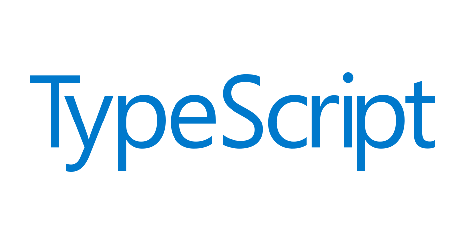

(WIP)Itsy-Bitsy Tips for Blockly 2. Let's Add an Auto-Complete Feature for Blockly (in Jetbrain's WebStorm)
==========================================================================

Blockly is an external library. Even though you can use it easily without enduring complicated install process, Blockly is **not** a built-in feature of JavaScript. So for Blockly, many convenience features, such as auto-complete and error checking are not available by default. 

However, those features **are** required when coding with Blockly library, since the syntax and naming of Blockly are pretty unique and long. Without auto-completion and/or error detection, it will be very hard to notice what's wrong while coding, and in the worst case, those "petty" typos can cause critical syntax errors, consuming your time and energy. So, it is better to add some custom features to your IDE or editor. But how?

Before the explanation, it is worth mentioning TypeScript, since the essential file being used in the customization process is written in TypeScript.

So, what is TypeScript?

TypeScript-Very Useful JavaScript Superset
------------------------------------------



[TypeScript](https://www.typescriptlang.org/) is a JavaScipt superset developed by Microsoft. Since it is free and open source, you can freely contribute on the project by forking and making a pull request on its [official GitHub Repository](https://github.com/Microsoft/TypeScript).

TypeScript is a strict syntactical superset of JavaScript, and adds optional static **typing** to the language. Since Vanilla JavaScript is **weakly typed** or **untyped** language, you do not need to specify the variable's data type when you declare it. JavaScript will resolve it automatically. 

However, when it comes to TypeScript, things are quite different.In TypeScript, you **need** to specify the variable's data type when declaring it. Let me show you an example.

You want to declare a variable 'temp' that holds the string "Temp variable", and show it in a message box using alert function. In JavaScript, you probably will code like below to do this:

```javascript
var temp="Temp variable";
alert(temp);
```

You just declared the variable without specifying its type, and it works without any problem.

Then how about TypeScript? Let's look at the TypeScript code that does the same thing as the code shown before.

```typescript
var temp: string="Temp variable";
alert(temp);
``` 

Can you find the difference? In TypeScript, you need to specify the variable's type using : . This is what makes TypeScript different from Vanilla JavaScript. Pretty interesting, right?

Since TypeScript is the superset of JavaScript, it can be said that every existing JavaScript programs are also a valid TypeScript programs. Also, every TypeScript code can be converted into JavaScript in the compiling process.

To use TypeScript, you first need to intall it using npm. (If you don't have Node.js installed on your environment, installation of Node.js must be done first.) Bring out the console window and type this:

```
npm install -g typescript
```

Once the installation is finished, you're ready to use TypeScript.

TypeScript Definition Files
-----------------------------------------

So, this is what TypeScript is. 

On the [TypeScript official web site](https://www.typescriptlang.org/), you can find out more information about TypeScript, such as its syntax and additional features.

In this document, we will not focus on its basic syntax; we will focus on the special usage of it. TypeScript here is used to **describe** certain JavaScript library's structure, as a form of **TypeScript definition files**.

TypeScript supports definition files that can contain type information of existing JavaScript libraries. Definition files can act like header files of C++, which can describe the structure of existing object files.

This feature enables other programs to use the values defined in the definition files, as if they were statically typed TypeScript entities. 


